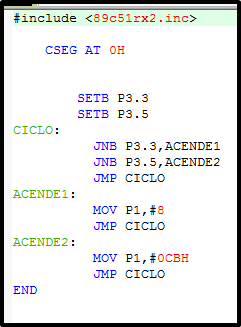

# Convert instructions to .hex file and check the outcome

We have to review the instructions, convert to opcodes and generate the .hex file

Note: For a more in-depth explanation check the following website:

http://what-when-how.com/8051-microcontroller/explaining-the-intel-hex-file/

## Hex file explained

Hex file starts with :10000000 (last 2 zeros might belong to a valid instruction)

:**10**000000 Indicates that this line has 10**H**(HEXADECIMAL) bytes = 16 bytes (max).
 
:10**0000**00 This is **CSEG AT**, which indicates where the **PC** should check the next instruction.
 
:100000**00** If this value is equal to **00** means that there are more lines to read besides this one.
  
If this value is **01** (check last line of code printscreen img) means this is the last line we have to read.
 

The values **0B**, **B9** and **FF** are checksum values and are used as a way to verify existing error in each line of code. (more info later on)

 
    Example code

 
    Example hex file for the given code

## Tasks:
1. Check instruction
2. Instructions can have 0,1,2 or 3 operands 
Examples:  
NOP 
CLR A 
MOV A, #03H 
CJNE A, #03H, LABEL 
So we have to **separate the string into its parts:** 
-1st part is the **operation** 
-2nd part, if there is one, are the **operands**. 

3. See conversion exercise:  
010H  hexadecimal 
010   octal 
10    decimal 
10B   binary 

4. Jumps have offsets, that are variable according to the size of the specific instruction: 
JZ 
JNZ 
JB 
JNB 
JMP 
SJMP 
AJMP 
LJMP 
CALL 
ACALL 

## String write order:

1. Write ':'

2. Write XX - Line size in bytes (hexadecimal value), maximum is 10H=16 bytes, 32 digits.

3. Write EEEE - Address of CSEG AT ....(default is 0000H)

4. Write 00 if its not END instruction. Write 01 if its the END instruction. (TT)

5. Write instruction opcodes. Create counter, the maximum byte value is 16. (counter==16?)

6. Write CC(checksum), which results from the following: 01h + NOT(02h + 00h + 00h + 04h + FFh + FFh) (check images)
  Sum 1 to the sum of hex bytes existing in the line.

## What to do with the file containing the instructions?

1. Read the file. Convert all content to CAPS letters

2. Read line by line, parse the instructions and convert to the respective opcodes.

## Want to see the source code (in C language)?? Click **[Here](./code.c)**