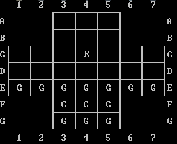
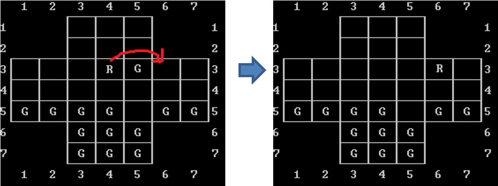

# Fox and Geese ASCII ART Game (my first ever programming project)

This game was developed using DevC++. This project has a game menu with 4 game modes: human vs human, human vs pc, pc vs human, pc vs pc. During the game, one of the players can save the game and load the saved game through a combination of coordinates.

If the fox is cornered on the game board, the game ends, declaring the win for the geese. If there are less than 6 geese in the board, the game ends with a victory for the fox.

# Game Origin

The origin of this game is uncertain, since there are multiple variants. However, it is considered to be created in Scandinavia. A game called "Hala-Tafl" is quoted in Grettis islandic saga. The game might have been brought to Europe by the South, coming from arabic areas, since it is similar to the game "Cercar la Liebre", described by King Afonso, in a 1283 manuscript.

Multiple variants of this game can be found across Europe, using different alias, like "Fox and Geese" in France and Germany, "Wolf and sheep" in Italy, Netherlands, Sweden and Russia.

## Rules

- One player has one counter (the fox) and the other player has thirteen counters (the geese).
- Players should toss a coin to decide who is the fox and who is the geese - the geese always move first.
- Arrange the gesse as shown in the diagram below. The fox can go on any vacant spot.

- The fox and geese can move along a line in any direction (including the diagonal lines) but can only move to the next free place
- The fox can take a goose by jumping over a goose onto a vacant space. Two or more geese can be removed if there are spaces between them to hop to.

- According to this game, geese can't jump!
-The player moving the geese will win if he/she can prevent the fox from moving
-The player moving the fox wins when he/she reduces the number of geese by so many that it is impossible to stop the fox from moving

## Final Result

## Want to see the source code?? Click **[Here](./src/raposa_recente.cpp)**
