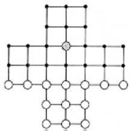

# Fox and Geese ASCII ART Game (my first ever programming project)

This game was developed using DevC++. This project has a game menu with 4 game modes: human vs human, human vs pc, pc vs human, pc vs pc. During the game, one of the players can save the game and load the saved game through a combination of coordinates.

If the fox is cornered on the game board, the game ends, declaring the win for the geese. If there are less than 6 geese in the board, the game ends with a victory for the fox.

# Game Origin

A origem deste jogo é algo incerta, pois existem várias variantes. Contudo, considera-se que teve as suas origens na Escandinávia. Um jogo conhecido como Hala-Tafl, é citado na saga islândica de Grettis. O jogo também pode ter chegado à Europa pelo Sul, vindo do mundo árabe, tendo em vista sua semelhança com o jogo Cercar la Liebre, descrito pelo Rei Afonso, em um manuscrito de 1283.
	Várias variantes deste jogo podem ser encontradas um pouco por toda a Europa, por nome diferentes como “A Raposa e as galinhas” na França e Alemanha; “O lobo e as ovelhas” na Itália, Holanda, Suécia e Rússia.
	É um tradicional jogo de caça e perseguição, em que existem 2 tipos de peças diferentes: a raposa e os gansos. A raposa tem como objectivo comer os gansos todos (ou, pelo menos, comer tantos gansos em que fique impossível que estes a rodeiem). Por sua vez, os gansos têm de rodear a raposa, impedindo-a de se mover para outra casa adjacente ou de comer um ganso.

## Rules

- One player has one counter (the fox) and the other player has thirteen counters (the geese).
- Players should toss a coin to decide who is the fox and who is the geese - the geese always move first.
- Arrange the gesse as shown in the diagram below. The fox can go on any vacant spot.
- The fox and geese can move along a line in any direction (including the diagonal lines) but can only move to the next free place
- The fox can take a goose by jumping over a goose onto a vacant space. Two or more geese can be removed if there are spaces between them to hop to.
- According to this game, geese can't jump!
-The player moving the geese will win if he/she can prevent the fox from moving
-The player moving the fox wins when he/she reduces the number of geese by so many that it is impossible to stop the fox from moving

## Instructions to play

1. Compile and run code (check file to install graphics library in DevC++)
2. Game menu works with keyboard, use numbers to choose options
3. Play using keyboard arrows
4. If you are left wondering what are the game controls, go to the Controls options in the starting menu or the pause menu
5. To acess the pause menu during the game, press either "Escape" or "p"
6. There are multiple options to make the game more appealing or increase its difficulty
7. To access the options go to Menu -> Options and use the numbers to (De)activate them

## Functionalities that exist in the game and are working properly

1. Save and Load
2. Starting and pause menu, with options to turn on/off certain game options, controls
3. Save level highscore by using attempt number
4. 10 different levels
5. Game rules
6. Controls
7. Options
    - Undo and redo
    - Hint
        

    - Show valid moves

    

    - Draw/Hide frog eyes

## Functionalities that are not yet present in the game

1. Player profiles

## Bonus image

This game also has an ASCII ART version

## Want to see the source code?? Click **[Here](./src/)**
