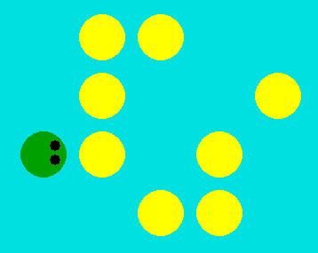
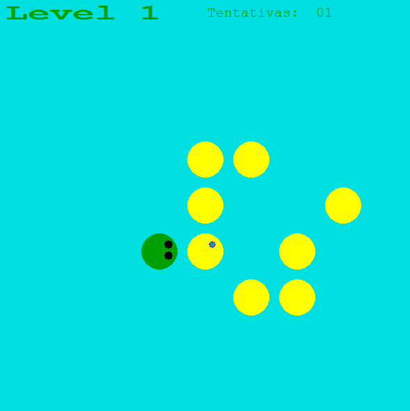
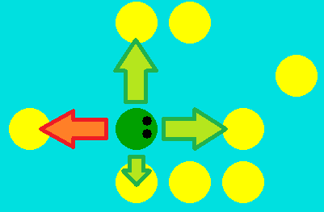
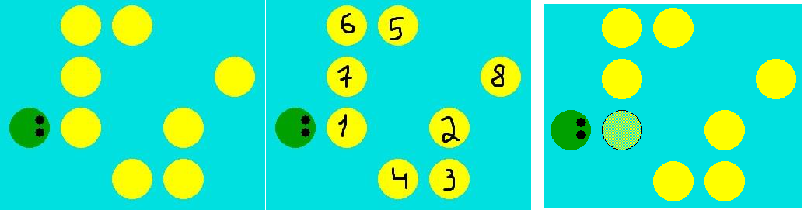
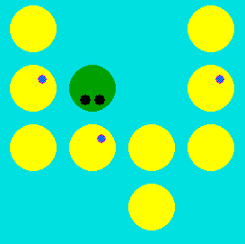
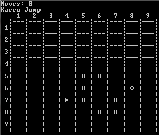

# Kaeru Jump Game

This game was developed using DevC++ and graphics.h library

In this final version of the game, we have a starting menu in which we can start a new game, load a saved game, check the game rules, controls, pause the game, save, undo/redo a move, etc. The last option in the menu is the "exit" option.

When the game starts, a level is loaded using a simple text file (LevelX.txt). If the player completes the level, a message appears saying "Completou o nível" and by pressing ENTER the player can go to the next level. If the player makes a bad move, he can Undo that move.

You can also restart the level by using ENTER or restarting the game by pressing "backspace" key.

There is a try counter on each level, that is used to save the level highscore in a text file.

The hint functionality allows the player have help to know the next move that it should do.

## Game Lore

Kareu Jump is a puzzle game in which the player controls a frog, whose sole purpose is to jump throught all the rocks present in the lake, in order to finish the level. The frog can't jump backwards. This game version has 10 levels that will slowly increase in difficulty.

## Rules

- The player wins if the frog jumped on all the rocks
- The frog can only use the rocks to move around the lake and after he has been on a rock, that one will sink in the lake when he moves to the next one
- If two rocks are adjacent, the frog will jump to the closest one

- The frog can only jump in vertical or horizontal directions, not diagonal
- The frog can't jump backwards

## Instructions to play

1. Compile and run code (check file to install graphics library in DevC++)
2. Game menu works with keyboard, use numbers to choose options
3. Play using keyboard arrows
4. If you are left wondering what are the game controls, go to the Controls options in the starting menu or the pause menu
5. To acess the pause menu during the game, press either "Escape" or "p"
6. There are multiple options to make the game more appealing or increase its difficulty
7. To access the options go to Menu -> Options and use the numbers to (De)activate them

## Functionalities that exist in the game and are working properly

1. Save and Load
2. Starting and pause menu, with options to turn on/off certain game options, controls
3. Save level highscore by using attempt number
4. 10 different levels
5. Game rules
6. Controls
7. Options
    - Undo and redo
    - Hint
        

    - Show valid moves

    

    - Draw/Hide frog eyes

## Functionalities that are not yet present in the game

1. Player profiles

## Bonus image

This game also has an ASCII ART version

## Want to see the source code?? Click **[Here](./src/)**
