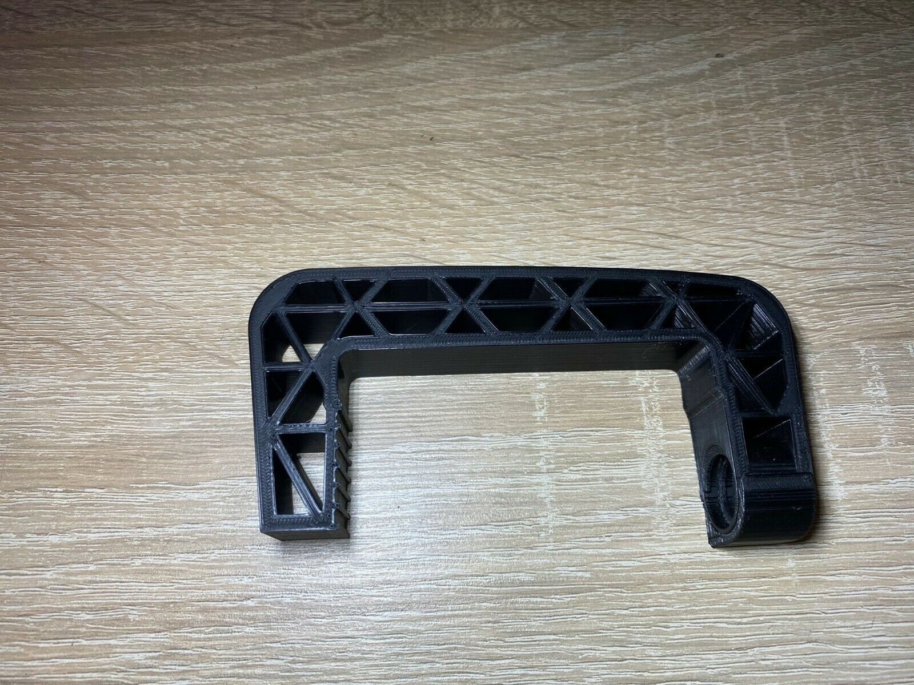
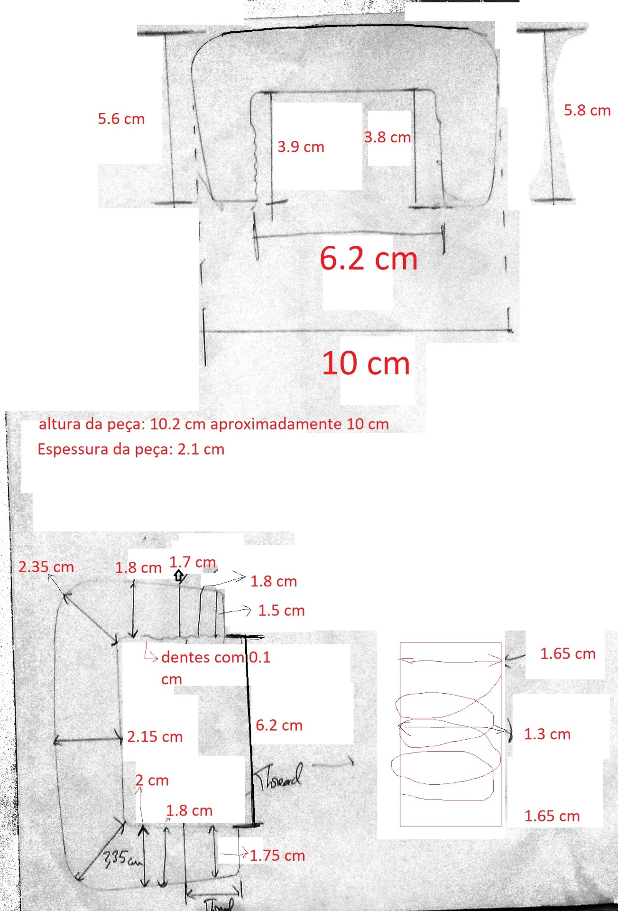
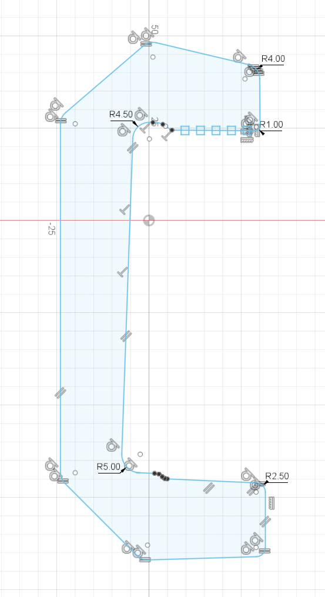
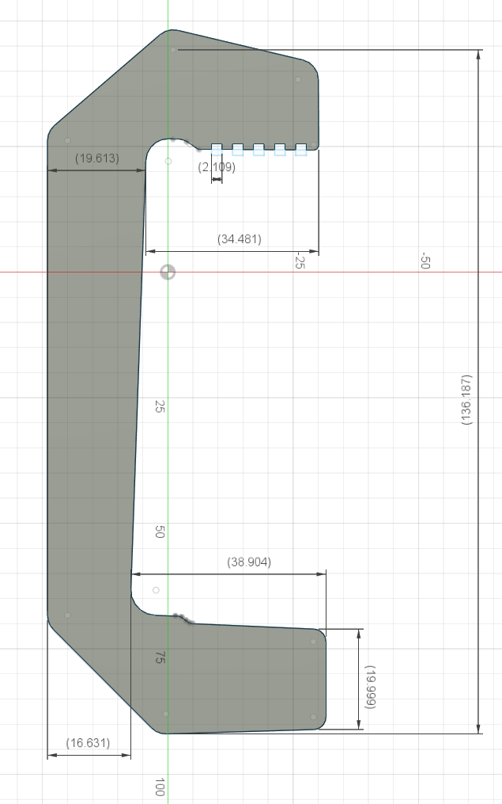
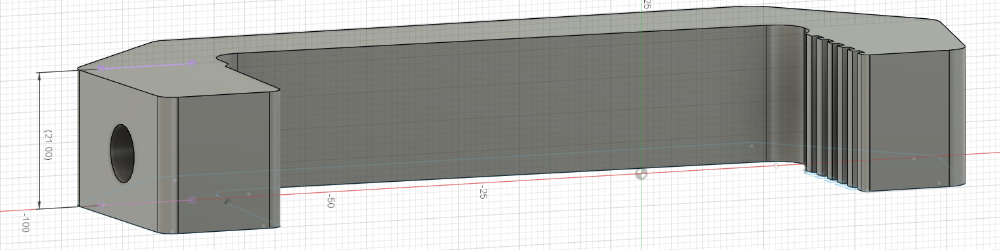
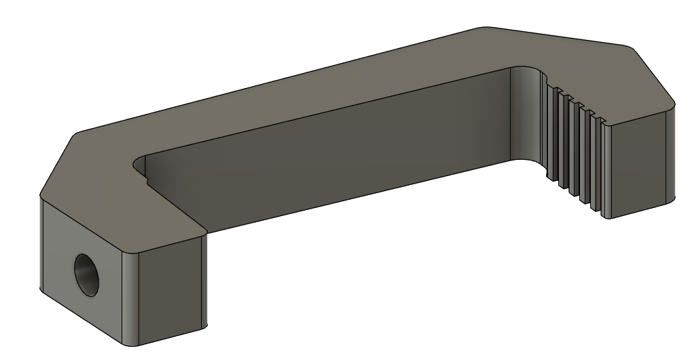
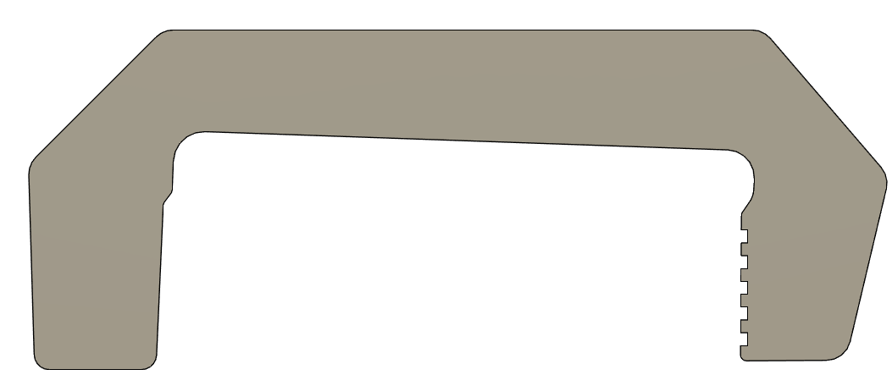
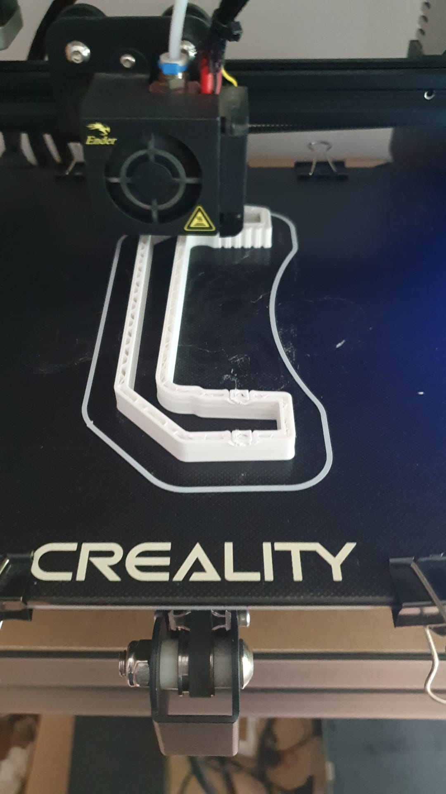
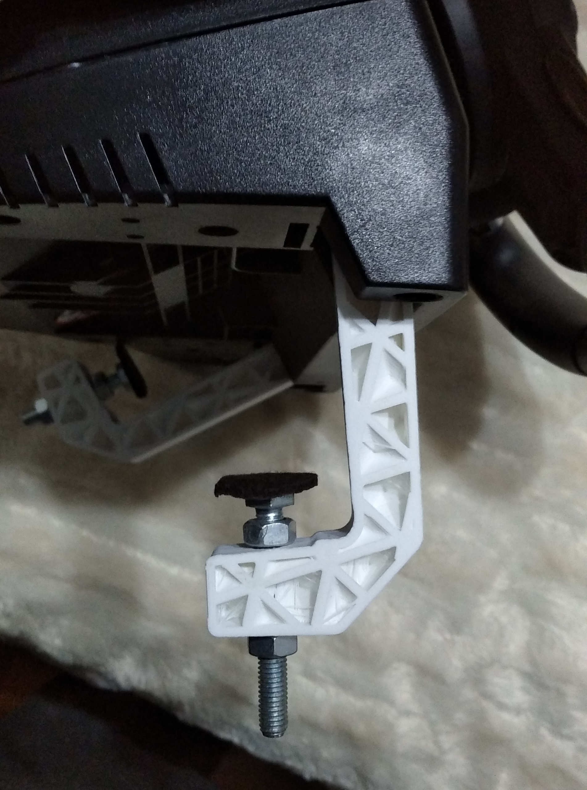

# Logitech Driving Force GT Extended Clamp

The objective of this project was to 3d print a **[clamp](https://guide-images.cdn.ifixit.com/igi/bfFxNVxvsH2C5BKi.medium)** for the **[Logitech Driving Force GT wheel](https://en.wikipedia.org/wiki/Logitech_Driving_Force_GT)**, used in sim racing games. The original parts were broken and official replacements would be too short for my desktop table. This extended version works perfectly with some nuts and bolts, but could be reconfigured for a 3d printed screw.

## Stage 1 - Design

To improve the original design, we needed some references of the actual piece, to pass the design into fusion360 to be modified.

## Stage 2 - Modifications

For the design and dimensions, check these images. Warning: All the dimensions are in mm (milimeters).
For a side profile of the clamp, this image can be used.

## Stage 3 - Final Design and 3d printing
The final product of this project was the following piece:

The next step was to export the file as a .stl file into a slicing software to 3d print the piece.

## Stage 4 - Assembly in the logitech wheel

The wheel had to be dissassembled in order to put the clamp inside, then the bolts and nuts were added to complete the clamping mechanism.

## Want to access the final stl file? Click **[Here](./clamp.stl)**
