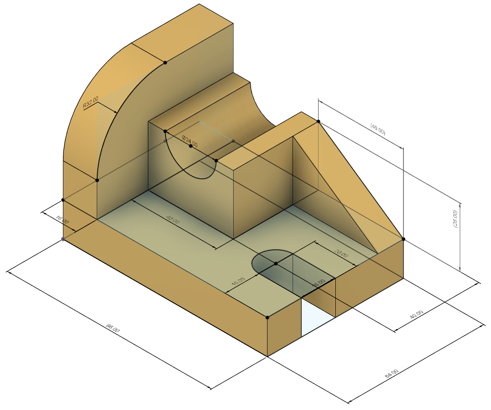

# Technical piece made using Fusion360

The objective of this project was to recreate a technical piece, using a Blender tutorial called **[Blender 2.8 Modeling a technical piece](https://youtu.be/WSR6bVFe5LM)** by **[yojigraphics](https://www.youtube.com/channel/UCMNKmWbQ5K387LIVM-Q2V_Q)** , but using **[Autodesk Fusion 360](https://www.autodesk.com/products/fusion-360/overview)**

It is a simple project that combines a few features, to get familiar with Fusion360 and its funcionalities/workflow.

The final product of this project was the following piece:

## Want to access the final stl file? Click **[Here](./technical_piece.stl)**
