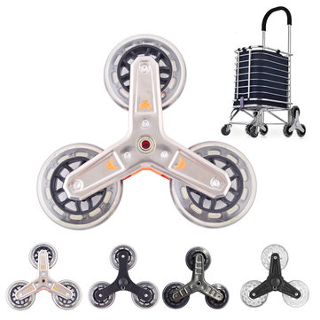
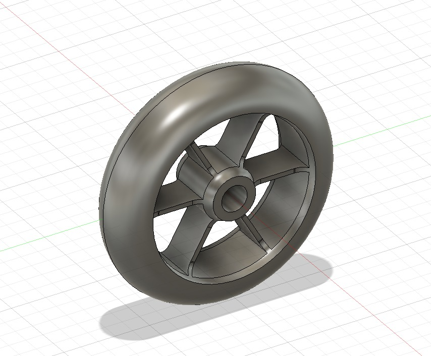
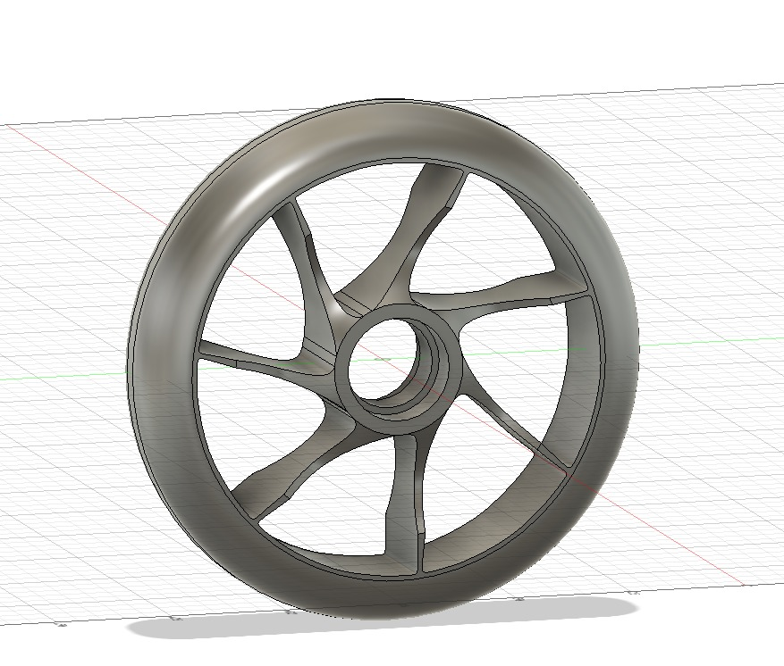
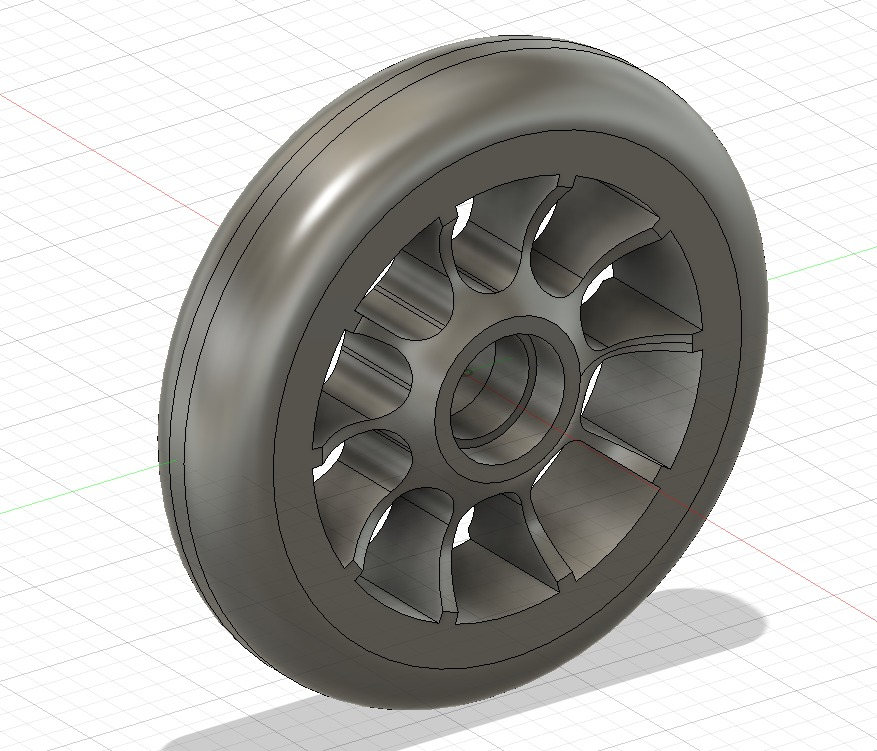
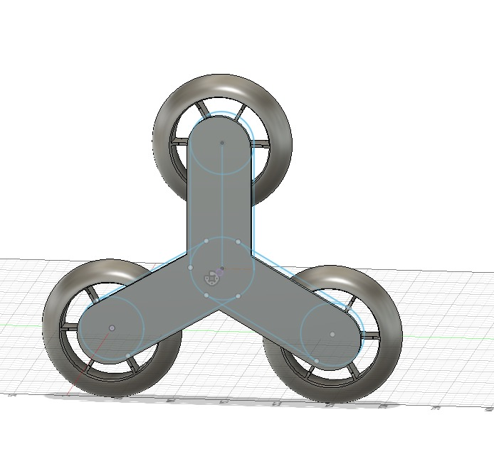
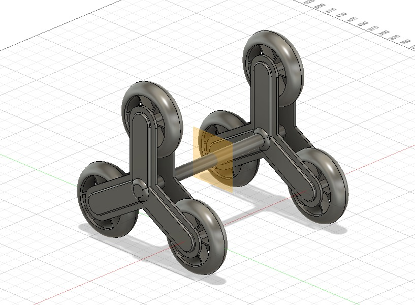

# Fusion360 Wheel Designs

The objective of this project was to design different wheels that could be used for scooters, shopping carts, etc. As you can see in this reference:

**** 

## Stage 1 - Designs

Since there were a lot of designs online, I tried to make ones that seemed appealing to me. So, in the end, I've got these 3 designs:

## Stage 2 - Combining the designs

After getting these designs, it was time to join them in a more functional prototype:

## Want to access the final stl file? Click **[Here](./wheels.stl)**
