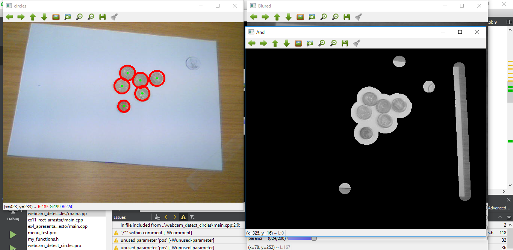

# Qt + OpenCV - Computer Vision exercises and Final project

## List of exercises

1. Open Image
2. Open Video
3. Open Webcam
4. Show Text
5. Keyboard Choice of option
6. Mouse choice of option
7. Trackbar test
8. Click and get coordinates of click
9. Draw dots on clicked spot
10. Draw lines with clicks
11. Draw rectangle by click and slide
12. Convert image to different color spaces by clicking
13. Use trackbar to change colors

## Final project - Money Detection

By using a basic webcam, calibrating it to detect stationary coins that appeared in front of it and using this algorithm, this project was able to detect and calculate the value of the coins by getting the approximate radius of the coins. (Results were not super accurate, should consider using a better camera).

<!--
## Want to see the source code?? Click **[Here](./projeto_detetar_valor_moedas/webcam_detect_coins)**

-->
